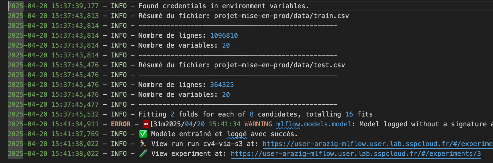
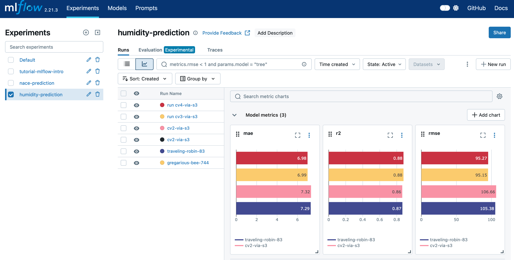

# 🌦️ Prédiction de l'Humidité Relative : *Mise en production projet Data Science*

Ce projet a pour objectif de prédire l'humidité relative à partir de données météorologiques. Il s'inscrit dans une démarche de **mise en production d’un modèle de machine learning**.

<p align="center">
  <!-- Logo du haut (centré) -->
  
  <br><br>
  <!-- Logos du bas (gauche et droite) -->
  
  &nbsp;&nbsp;&nbsp;&nbsp;
  
</p>


> **Description et Contexte** :  
> L’humidité relative est une mesure de la quantité de vapeur d’eau présente dans l’air par rapport à la quantité maximale qu’il peut contenir à une température donnée. Elle est exprimée en pourcentage, où 100 % signifie que l’air est entièrement saturé de vapeur d’eau et ne peut plus en contenir davantage, ce qui peut entraîner de la condensation (comme la rosée ou le brouillard).
>  
> La capacité de l’air à contenir de l’humidité dépend de la température : un air plus chaud peut contenir davantage de vapeur d’eau, tandis qu’un air plus froid en retient moins. C’est pourquoi l’humidité semble souvent plus élevée par temps chaud, même si la quantité réelle de vapeur d’eau dans l’air n’a pas changé. Par exemple, si l’humidité relative est de 50 %, cela signifie que l’air contient la moitié de l’humidité qu’il pourrait potentiellement contenir à cette température. Une humidité relative élevée (comme 80–90 %) donne une sensation d’air lourd et humide, tandis qu’une humidité relative faible (comme 20–30 %) rend l’air sec, ce qui peut provoquer des désagréments comme la sécheresse de la peau ou des irritations.
>  
> Dans la zone géographique marocaine, l’humidité relative joue un rôle essentiel dans la prévision des sécheresses, la gestion des ressources en eau et la compréhension de la variabilité climatique. Les régions semi-arides et arides du pays sont particulièrement sensibles aux fluctuations de l’humidité, qui influencent l’humidité des sols et les rendements agricoles. Une faible humidité relative accélère l’évaporation dans les réservoirs et les systèmes d’irrigation, aggravant la pénurie d’eau. Dans les zones côtières et montagneuses, les variations d’humidité influencent la formation des nuages et les régimes de précipitations, impactant l’agriculture et la production d’énergie hydraulique. En intégrant les données d’humidité relative dans les modèles climatiques, les scientifiques et les décideurs peuvent mieux anticiper les risques de sécheresse et optimiser les stratégies de gestion de l’eau pour en atténuer les effets.
> 


 ---
 


## 📌 Objectifs

- Prétraitement et nettoyage des données météorologiques
- Entraînement d’un modèle de prédiction de l’humidité relative
- Évaluation des performances
- Déploiement du modèle via une API ou une interface web

## 🔧 Stack technique

- Python
- Pandas, NumPy
- Scikit-learn 
- MLOPS
- Docker 

## 📁 Structure du projet

## Getting started

Etapes pour l'utilisation de notre projet
#### Clone du dépôt
   ```bash
   git clone https://github.com/AhmedProj/PrimePredict.git
   cd Mise-en-production-project
   ```

### Installation de packages

Pour exécuter le code et tester le notebook de démo, vous devez installer les dépendances listées
dans `requirements.txt`. Vous pouvez le faire avec la ligne de commande suivante :

```bash
pip install -U -r requirements.txt
```
### Procédure d'entrainement, cross validation et fine Tuning avec MLFLOW
   ```bash
    python train.py \
      --remote_server_uri $MLFLOW_TRACKING_URI \
      --experiment_name "humidity-prediction" \
      --run_name " nom_du_run " \
      --cv 2 \
      --bucket " XXXXXXXXX " \
      --train_path "projet-mise-en-prod/data/train.csv" \
      --test_path "projet-mise-en-prod/data/test.csv" \
      --target_col "relative_humidity"
   ```
> 📌 Les logs d'entraînement sont automatiquement enregistrés dans `log/train.log`. Cela permet une gestion optimale de l'API et un suivi de ce qui s'excecute.
<p align="center">
  
</p>


### L’interface MLflow  📊 
 > Elle permt de voir : 
 > * les métriques
 > * les paramètres
 > * les artefacts
 > * les modèles enregistrés

> Voici comment se présente notre fine-tuning sur MLflow :

> 

### Et enfin : les tests 

Les tests unitaires sont dans le dossier `test_unitaire`. Pour les exécuter, on utilise la commande :
```bash
python -m pytest test_unitaire/
```


### ANNEXE : Streamlit pour la vizualisation

Bien que le parcours choisi pour ce projet soit celui de **MLOps**, nous avons apprécié découvrir la possibilité de créer des interfaces interactives. C'est pourquoi nous avons dédié un dossier de notre répertoire au développement de cette interface pour mettre en avant notre projet.

On peut retrouver l'application dans le dossier streamlit avec :
- Une page d'accueil
- Deux pages supplémentaires

Pour lancer l'application en local, voici la ligne de commande à suivre :
```bash
streamlit run streamlit/streamlit_app.py
```
